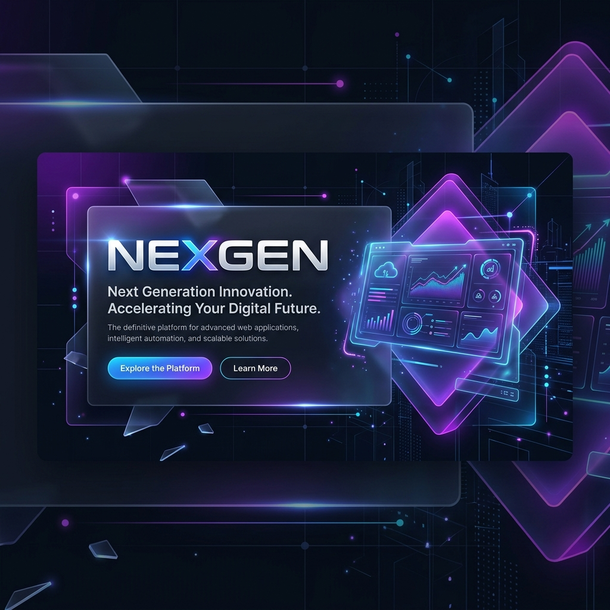

# NexGen - Premium Responsive Landing Page



> An ultra-premium, modern landing page featuring cutting-edge Glassmorphism aesthetics, responsive grids, and advanced interactive animations designed for next-generation web applications.

[](LICENSE)
[](https://github.com/Siddhantnaik909/responsive-landing-page/stargazers)
[](https://github.com/Siddhantnaik909/responsive-landing-page/network)

---

## ✨ Features

- 🛸 **Interactive Floating Navigation Menu**:
  - **Dynamic Scrolling Adaptations**: The navbar seamlessly morphs from a transparent top header into a floating glassmorphic capsule with glowing gradient borders and box shadows.
  - **Magnetic Sliding Selector**: A fluid gradient pill glides behind the text links on hover, resizing dynamically to match the length of each menu item.
  - **Auto-Syncing Active States**: Using the `IntersectionObserver` API, the sliding capsule tracks active page sections automatically in real-time as the user scrolls.
- 🎨 **Premium Aesthetics**:
  - Glassmorphic panels with depth, backdrop blurs, and thin glowing borders.
  - Curated, harmonious dark and light color systems (custom HSL accent gradients).
  - Elegant typing text micro-animations and smooth scroll reveal behaviors.
- 🌗 **Instant Theme Toggle**: Toggle between light and dark modes instantly with saved settings in local storage.
- 📱 **Robust Cross-Device Responsiveness**: Hand-crafted vanilla media queries that ensure pixel-perfect rendering across small mobile displays, tablets, laptops, and ultra-wide screens.
- 📈 **Animated Counters**: Numbers roll up dynamically when the Statistics section scrolls into view.
- 📁 **Portfolio Filter Grid**: Sort portfolios by category seamlessly with dynamic fade-in/fade-out animations.

---

## 🛠️ Tech Stack

- **Core**: HTML5, Semantic Markups
- **Styling**: Vanilla CSS3 (Custom Variables, Flexbox, CSS Grid)
- **Interactivity**: Vanilla ES6+ JavaScript
- **Icons**: FontAwesome 6.4.0
- **Typography**: Google Fonts (Poppins)

---

## 📂 Project Structure

```text
Responsive Landing Page/
├── assets/
│   └── banner.png         # Project banner image
├── css/
│   ├── style.css          # Primary layout, typography, glass system, and desktop styles
│   └── responsive.css     # Responsive media queries and mobile drawer transitions
├── js/
│   └── main.js            # Typing text, slider math, intersection observer, counters, and themes
├── index.html             # HTML core markup file
├── LICENSE                # Open-source MIT License file
├── CONTRIBUTING.md        # Collaboration and contribution guidelines
└── README.md              # Project documentation
```

---

## 🚀 Getting Started & Local Setup

Since this is a fully static client-side web application, running it locally is incredibly simple and requires no dependencies.

### Option A: Open Directly
Simply double-click the `index.html` file in your file explorer to open it in any modern web browser.

### Option B: Local Server (Recommended)
To fully enjoy all features (like smooth font loading and modules without CORS policies), run a simple local web server:

**Using Python:**
```bash
python -m http.server 8000
```
Then open your browser to `http://localhost:8000`.

**Using Node.js (`serve` or `live-server`):**
```bash
npx serve .
```

---

## 🤝 Contributing

We welcome all contributions! Whether it is fixing bugs, adding new sections, improving responsive styles, or optimizing micro-animations:
1. Fork the repository.
2. Create a feature branch (`git checkout -b feature/cool-new-animation`).
3. Commit your changes (`git commit -m "Add cool new animation"`).
4. Push to the branch (`git push origin feature/cool-new-animation`).
5. Open a Pull Request.

Please read our [CONTRIBUTING.md](CONTRIBUTING.md) for detailed contribution workflows and guidelines.

---

## 📜 License

This project is licensed under the MIT License - see the [LICENSE](LICENSE) file for details.
